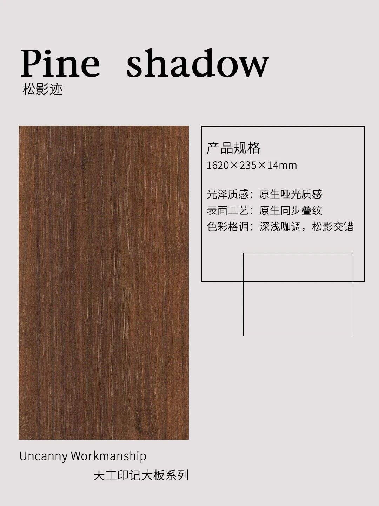
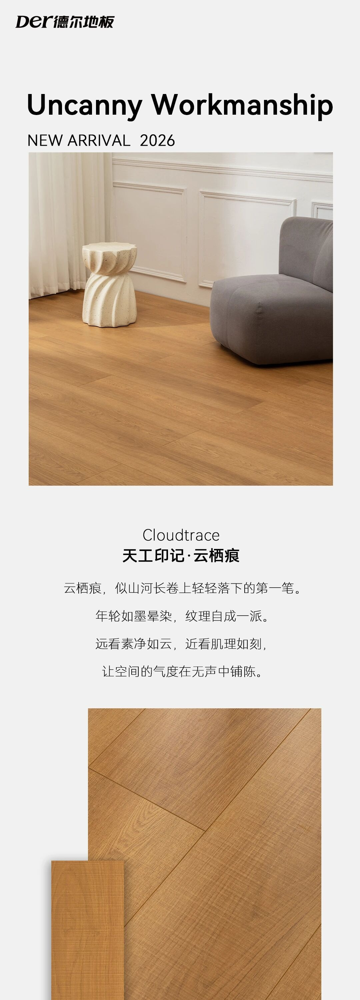

# 德尔地板产品图素材清单 v3（最终版）
> 2026-07-09 | 给 GLM-5.2 的编码用表
> 所有图片在 `images/` 目录下，相对路径引用
> **GLM 不需要做任何图片裁切/处理，直接用文件名即可**

---

## 文件总览：每个 HTML 位置 → 用哪个文件

### 一、天工印记系列主卡 `.p-hero.w-tiangong`
| 推荐方案 | 文件 | 尺寸 | 说明 |
|----------|------|------|------|
| **A 方案** | `tiangong-all.jpg` | 1165×1700 | 6 色竖排合集，中文标签，**推荐作背景图** |
| B 方案 | `tg-yunhenxi-hero.jpg` | 1080×3000 | 云栖痕详情首屏（灰沙发场景+大板+文字） |
| C 方案 | `tg-songyingji-hero.jpg` | 1080×3000 | 松影迹详情首屏（绿椅子场景+大板） |

→ **建议用 A 方案**：`background-image: url('images/tiangong-all.jpg'); background-size: cover; background-position: center;`

---

### 二、天工印记 6 色 — 每个花色对应的文件

#### ① 云栖痕 Cloudtrace
| 用途 | 文件 | 尺寸 |
|------|------|------|
| **花色展示主图** | `tg-yunhenxi-hero.jpg` | 1080×3000 |
| 大板特写 | `tg-yunhenxi-board.jpg` | 1080×1440 |
| 多角度细节 | `tg-yunhenxi-details.jpg` | 1080×6000 |
| 色卡小样（横排） | `tg-cloudtrace-sw.jpg` | 180×1440 |
| 色卡小样（竖排） | `tg-cloudtrace-vsw.jpg` | 1165×261 |

#### ② 泽曦木 Zexiwood
| 用途 | 文件 | 尺寸 |
|------|------|------|
| **色卡/展示** | `tg-zexiwood-sw.jpg` | 180×1440 |
| 备选竖版 | `tg-zexiwood-vsw.jpg` | 1165×261 |

#### ③ 松影迹 Pine shadow ⭐ 图最多
| 用途 | 文件 | 尺寸 |
|------|------|------|
| **花色展示主图** | `tg-songyingji-specs.jpg` | 原尺寸 |
| 海报风格 | `tg-songyingji-poster.jpg` | 原尺寸 |
| 详情长图 | `tg-songyingji-detailpage.jpg` | 1080×12000 |
| 详情首屏 | `tg-songyingji-hero.jpg` | 1080×3000 |
| 室内场景 | `tg-songyingji-room.jpg` | 原尺寸 |
| 浅色近拍 | `tg-songyingji-light.jpg` | 原尺寸 |
| 深色近拍 | `tg-songyingji-dark.jpg` | 原尺寸 |
| 棕色近拍 | `tg-songyingji-brown.jpg` | 原尺寸 |
| 色卡横排 | `tg-songyingji-sw.jpg` | 180×1440 |
| 色卡竖排 | `tg-songyingji-vsw.jpg` | 1165×261 |

#### ④ 玄穹脉 Celestial vein
| 用途 | 文件 | 尺寸 |
|------|------|------|
| **色卡/展示** | `tg-celestialvein-sw.jpg` | 180×1440 |
| 备选竖版 | `tg-celestialvein-vsw.jpg` | 1165×261 |

#### ⑤ 辰年漪 Ripple
| 用途 | 文件 | 尺寸 |
|------|------|------|
| **色卡/展示** | `tg-ripple-sw.jpg` | 180×1440 |
| 备选竖版 | `tg-ripple-vsw.jpg` | 1165×261 |

#### ⑥ 风栾织 Dancing wind
| 用途 | 文件 | 尺寸 |
|------|------|------|
| **色卡/展示** | `tg-dancingwind-sw.jpg` | 180×1440 |
| 备选竖版 | `tg-dancingwind-vsw.jpg` | 1165×261 |

---

### 三、摩登系列主卡 `.p-hero.w-honey`
| 推荐方案 | 文件 | 尺寸 |
|----------|------|------|
| **A 方案（推荐）** | `modern-mili.png` | 原尺寸 | 单独蜜栎色卡，干净 |
| B 方案 | `md-mili-hero.jpg` | 1080×2640 | 蜜栎完整详情（场景+大板+文字） |

→ **建议用 A 方案** 作背景，或用 `` 标签

---

### 四、摩登 3 色色卡 `.swatches` — 直接替换

| 芲 | 文件名 | 说明 |
|----|--------|------|
| 蜜栎 | `modern-mili.png` | ✅ 已有原名，直接用 |
| 雾境 | `modern-wujing.png` | ✅ 已有原名，直接用 |
| 焙痕 | `modern-beihen.png` | ✅ 已有原名，直接用 |

> 这三个不需要裁切图，原图就是干净的单独色卡。

---

### 五、摩登系列补充素材（从长图裁出）

| 内容 | 文件 | 尺寸 |
|------|------|------|
| 蜜栎详情区 | `md-mili-hero.jpg` | 1080×2640 |
| 雾境详情区 | `md-wujing-hero.jpg` | 1080×2640 |
| 焙痕详情区 | `md-beihen-hero.jpg` | 1080×3000 |
| 三色小样条 | `md-tricolor-strip.jpg` | 1080×840 |

---

## 六、GLM 编码速查表（复制即用）

```
HTML 位置                          →  图片文件
─────────────────────────────────────────────────────
天工印记 .p-hero.w-tiangong 背景   →  images/tiangong-all.jpg
摩登系列 .p-hero.w-honey 背景      →  images/modern-mili.png

天工·云栖痕 展示图                 →  images/tg-yunhenxi-hero.jpg
天工·泽曦木 色卡                   →  images/tg-zexiwood-sw.jpg
天工·松影迹 展示图                 →  images/tg-songyingji-specs.jpg
天工·玄穹脉 色卡                   →  images/tg-celestialvein-sw.jpg
天工·辰年漪 色卡                   →  images/tg-ripple-sw.jpg
天工·风栾织 色卡                   →  images/tg-dancingwind-sw.jpg

摩登·蜜栎 色卡                     →  images/modern-mili.png
摩登·雾境 色卡                     →  images/modern-wujing.png
摩登·焙痕 色卡                     →  images/modern-beihen.png
```

---

## 七、CSS 写法示例

### 主卡背景图替换：
```css
.p-hero.w-tiangong {
    background-image: url('images/tiangong-all.jpg');
    background-size: cover;
    background-position: center;
}
.p-hero.w-honey {
    background-image: url('images/modern-mili.png');
    background-size: cover;
    background-position: center;
}
```

### 色卡渐变替换为实图：
```css
/* 原来 */
.sw { background: linear-gradient(135deg,#c9a26d,#b8915c); }

/* 改为 */
.sw-mili     { background-image: url('images/modern-mili.png'); background-size: cover; }
.sw-wujing   { background-image: url('images/modern-wujing.png'); background-size: cover; }
.sw-beihen   { background-image: url('images/modern-beihen.png'); background-size: cover; }
.sw-cloudtrace  { background-image: url('images/tg-cloudtrace-sw.jpg'); background-size: cover; }
.sw-zexiwood    { background-image: url('images/tg-zexiwood-sw.jpg'); background-size: cover; }
.sw-songyingji  { background-image: url('images/tg-songyingji-sw.jpg'); background-size: cover; }
.sw-celestial   { background-image: url('images/tg-celestialvein-sw.jpg'); background-size: cover; }
.sw-ripple      { background-image: url('images/tg-ripple-sw.jpg'); background-size: cover; }
.sw-dancingwind { background-image: url('images/tg-dancingwind-sw.jpg'); background-size: cover; }
```

### 天工花色区域插入展示图：
在每个花色的 `<li>` 或 `<div>` 内加 `` 标签：
```html
<!-- 松影迹示例 -->

<!-- 云栖痕示例 -->

```

---

## 八、注意事项

1. **不要改 VR 链接和计价器逻辑**
2. **保持苹果风格 UI 不变**
3. 卓羡 / 德尔复合板 / 龙凤檀 / 橡木 → 保持原 CSS 渐变，这 4 个没有图
4. 所有路径用 `images/` 开头的相对路径
5. `-sw.jpg` 后缀的文件是横排版色卡（180px 宽），适合做小色块
6. `-hero.jpg` 后缀的文件是详情展示大图（~1080×3000），适合做花色详情主图
7. 带中文标签的图片可以直接用作展示，标签内容是产品卖点文字
